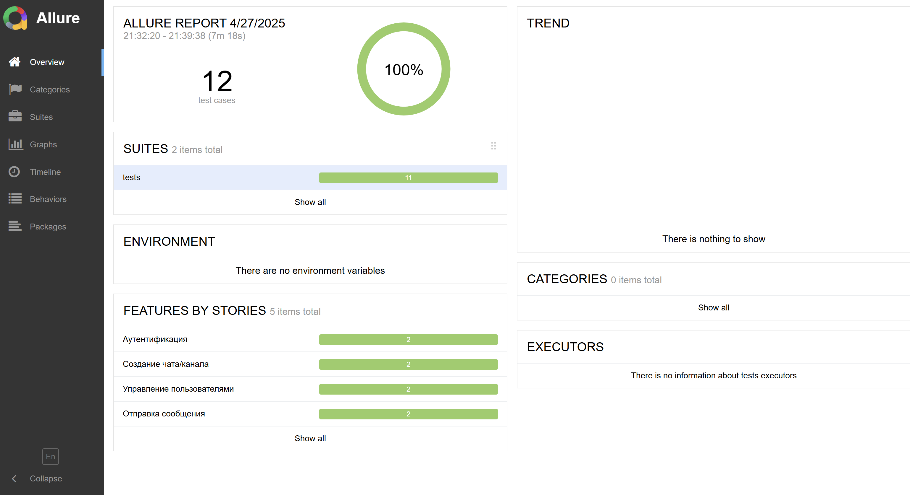
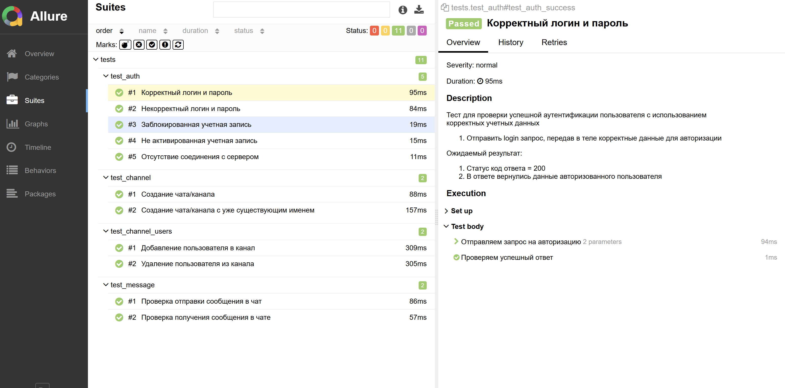

# Проект автотестов для проверки API взаимодествия с сервисом для обмена сообщениями Mattermost

### Список проверок

- [x] Успешная аутентификация с корректным логином и паролем
- [x] Неуспешная аутентификация с некорректным логином и паролем
- [x] Неуспешная аутентификация с заблокированной учетной записью
- [x] Неуспешная аутентификация с не активированной учетной записью
- [x] Неуспешная аутентификация при отсутствии соединения с сервером
- [x] Создание чата/канала
- [x] Создание чата/канала с уже существующим именем
- [x] Добавление пользователя в канал
- [x] Удаление пользователя из канала
- [x] Проверка отправки сообщения в чат
- [x] Проверка получения сообщения в чате

### Локальный запуск автотестов

#### Выполнить в cli:
```bash
python -m venv .venv
source .venv/bin/activate
pip install -r requirements.txt
pytest
```

#### Получение отчёта:
```bash
allure serve ./reports
```

### Allure отчет

#### Общие результаты


#### Шаги выполнения и список тестов


#### Распределение по категориям

