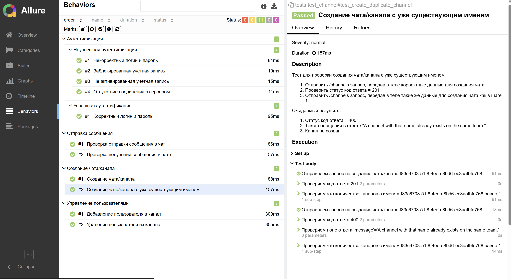

# Проект автотестов для проверки API взаимодествия с сервисом для обмена сообщениями Mattermost

### Локальный запуск автотестов

#### Выполнить в cli:
```bash
python -m venv .venv
source .venv/bin/activate
pip install -r requirements.txt
pytest
```

#### Получение отчёта:
```bash
allure serve ./reports
```

### Allure отчет

#### Общие результаты


#### Шаги выполнения и список тестов


#### Распределение по категориям

